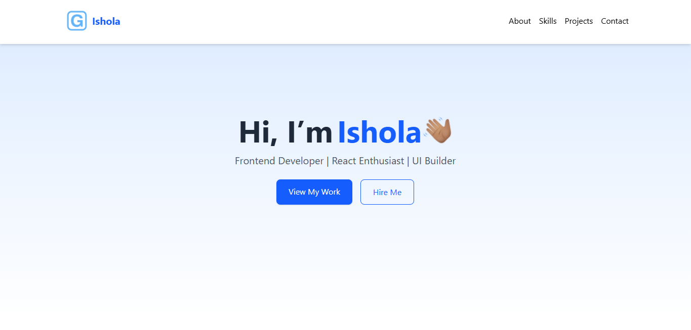
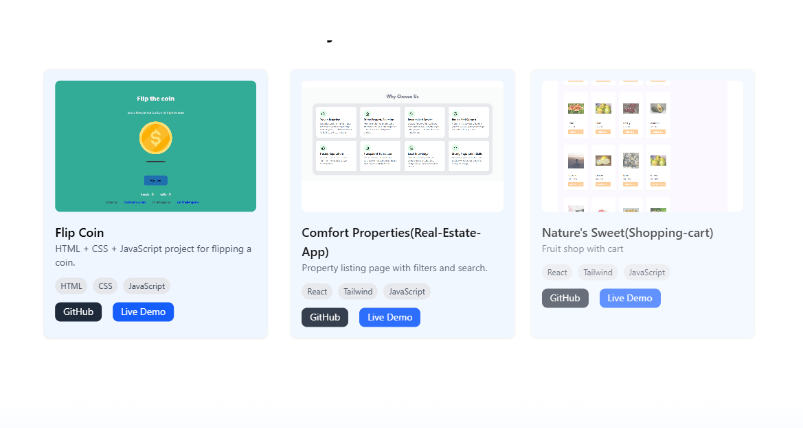

# 🌐 Personal Portfolio Website

Welcome to my **Frontend Developer Portfolio**!  
This project highlights my transition into frontend development, the projects I’ve built along the way, and the skills I’ve mastered.  

---

## 🚀 Live Demo
👉 View My Portfolio : http://gbolahanportfolio.netlify.app/

---

## 🛠️ Tech Stack
- **React** – Component-based UI development  
- **Tailwind CSS** – Modern utility-first styling  
- **JavaScript (ES6+)** – Core programming language  
- **Git & GitHub** – Version control & collaboration  
- **Netlify** – Deployment and hosting  

---

## ✨ Features
- 📱 **Responsive Design** – Optimized for mobile, tablet, and desktop  
- 🎨 **Clean UI/UX** – Minimalistic and user-friendly design  
- 🖼️ **Project Showcase** – Live demos + GitHub links for each project  
- ⚡ **Animations** – Smooth transitions using CSS/Framer Motion  
- 📬 **Contact Form** – Easy way to connect with me  

---

## 📸 Screenshots
### Homepage  


### Projects Section  
 

  

---

## 📂 Project Structure
```bash
portfolio/
│── src/
│   ├── components/   
│   ├── pages/        
│   └── App.js
│── public/
│── package.json
│── README.md

